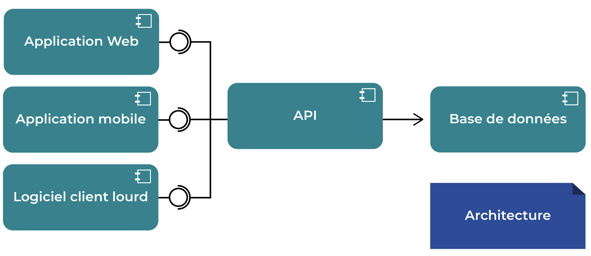

## HR

HR Association is a company that wants to offer an employee management service to small businesses.

The idea is to offer a suite of digital tools (software, web application, even mobile application) ready to use.

Here is the imagined architecture :

To launch this project, HR Association wants above all to provide an API that will allow all other applications to access the same data.

Framework: Spring + bootstrap 
Language: French 
Source: [Openclassrooms](Openclassrooms.com) Online course => Introduction to Spring